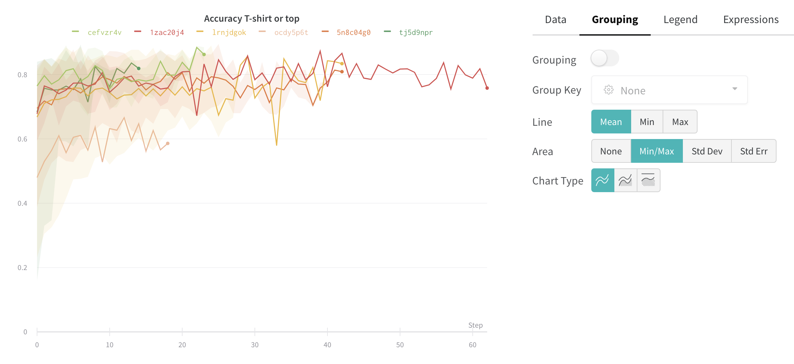

# Grouping

If your experiments are made up of smaller pieces like training and evaluation steps, you can group runs together in the UI. Our grouping feature is useful for distributed training or combining multiple process types into one experiment.

There are a few ways to use grouping:

1. **In your script**: You can optionally give your runs a group ID and a job type when you call wandb.init\(\). For example:`wandb.init(group="experiment_1", job_type="eval")`
   1. **group** should be unique within your project and shared by all runs in the group.  You can use `wandb.util.generate_id()` to generate a unique 8 character string to use in all your processes.  i.e. `os.environ["WANDB_RUN_GROUP"] = "experiment-" + wandb.util.generate_id()`
2. \*\*\*\*[**Environment Variable**](../environment-variables.md): Set`WANDB_RUN_GROUP`
3. **In the UI**: You can dynamically group by any config column. For example, if you use `wandb.config` to log batch size or learning rate, you can then group by those hyperparameters dynamically in the web app. 

If you set grouping in your script, we will group the runs by default in the table in the UI. You can toggle this on and off by clicking the **Group** button at the top of the table. Here's an example of grouping on the project page.

* **Sidebar**: Runs are grouped by the number of epochs.
* **Graphs**: Each line represents the mean of the group, and the shading indicates the variance. This behavior can be change in the graph settings.

### Turn off grouping

I can click the grouping button and clear group fields at any time, which returns the table and graphs to their ungrouped state.

### Grouping graph settings

Click the edit button in the upper right corner of a graph and select the **Advanced** tab to change the line and shading. You can select the mean, minimum, or maximum value to for the line in each group. For the shading, you can turn off shading, show the min and max, the standard deviation, and the standard error.

