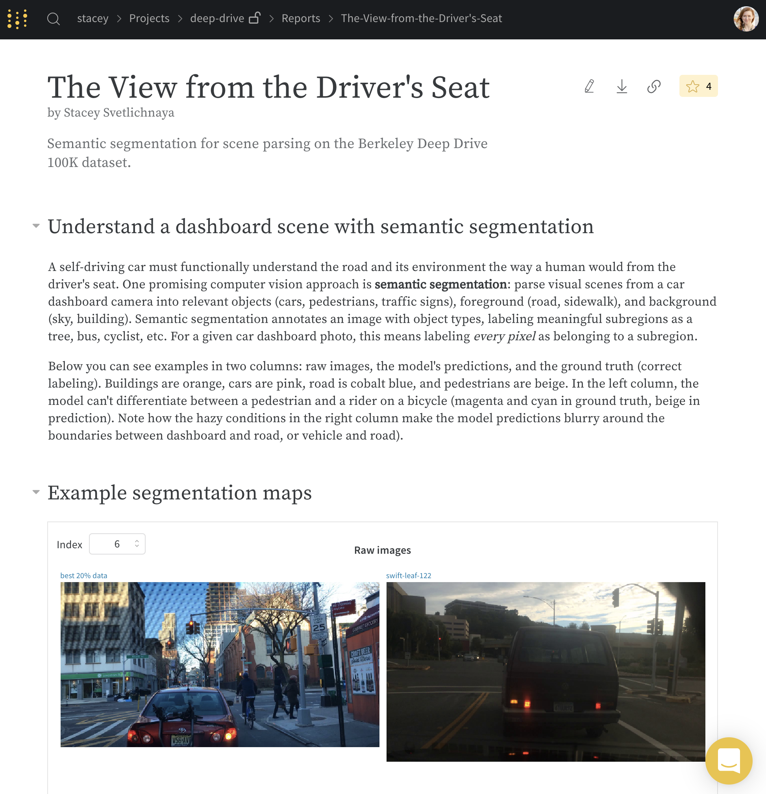

# Quickstart

Start logging machine learning experiments in three quick steps.

## 1. Install Library

Install our library in an environment using Python 3.

```bash
pip install wandb
```


If you are training models in an automated environment where it's inconvenient to run shell commands, such as Google's CloudML, you should look at the documentation on [Running in Automated Environments](https://docs.wandb.com/advanced/automated).


## 2. Create Account

Sign up for a free account in your shell or go to our [sign up page](https://app.wandb.ai/login?signup=true).

```bash
wandb login
```

## 3. Modify your training script

Add a few lines to your script to log hyperparameters and metrics.


Weights and Biases is framework agnostic, but if you are using a common ML framework, you may find framework-specific examples even easier for getting started. We've built framework-specific hooks to simplify the integration for [Keras](https://docs.wandb.com/frameworks/keras), [TensorFlow](https://docs.wandb.com/frameworks/tensorflow), [PyTorch](https://docs.wandb.com/frameworks/pytorch), [Fast.ai](https://docs.wandb.com/frameworks/fastai), [Scikit-learn](https://docs.wandb.com/frameworks/scikit), [XGBoost](https://docs.wandb.com/frameworks/xgboost), [Catalyst](https://docs.wandb.com/frameworks/catalyst), and [Jax](https://docs.wandb.com/frameworks/jax-example).


### Initialize Wandb

Initialize `wandb` at the beginning of your script right after the imports.

```python
# Inside my model training code
import wandb
wandb.init(project="my-project")
```

We automatically create the project for you if it doesn't exist. Runs of the training script above will sync to a project named "my-project". See the [wandb.init](library/init.md) documentation for more initialization options.

### Declare Hyperparameters

It's easy to save hyperparameters with the [wandb.config](library/config.md) object.

```python
wandb.config.dropout = 0.2
wandb.config.hidden_layer_size = 128
```

### Log Metrics

Log metrics like loss or accuracy as your model trains \(in many cases we provide framework-specific defaults\). Log more complicated output or results like histograms, graphs, or images with [wandb.log](library/log.md).

```python
def my_train_loop():
    for epoch in range(10):
        loss = 0 # change as appropriate :)
        wandb.log({'epoch': epoch, 'loss': loss})
```

### Save Files

Anything saved in the `wandb.run.dir` directory will be uploaded to W&B and saved along with your run when it completes. This is especially convenient for saving the literal weights and biases in your model:

```python
# by default, this will save to a new subfolder for files associated
# with your run, created in wandb.run.dir (which is ./wandb by default)
wandb.save("mymodel.h5")

# you can pass the full path to the Keras model API
model.save(os.path.join(wandb.run.dir, "mymodel.h5"))
```

Great! Now run your script normally and we'll sync the logs in a background process. Your terminal output, metrics, and files will be synced to the cloud, along with a record of your git state if you're running from a git repo.


If you're testing and want to disable wandb syncing, set the [environment variable](library/advanced/environment-variables.md) WANDB\_MODE=dryrun


## Next Steps

Now you've got the instrumentation working, here's a quick overview of cool features:

1. **Project Page**: Compare lots of different experiments in a project dashboard. Every time you run a model in a project, a new line appears in the graphs and in the table. Click the table icon on the left sidebar to expand the table and see all your hyperparameters and metrics. Create multiple projects to organize your runs, and use the table to add tags and notes to your runs.
2. **Custom Visualizations**: Add parallel coordinates charts, scatter plots, and other advanced visualizations to explore your results.
3. **Reports**: Add a Markdown panel to describe your research results alongside your live graphs and tables. Reports make it easy to share a snapshot of your project with collaborators, your professor, or your boss!
4. **Frameworks**: We have special integrations for popular [frameworks](library/frameworks/) like PyTorch, Keras, and XGBoost.
5. **Showcase**: Interested in sharing your research? We're always working on blog posts to highlight the amazing work of our community. Message us at contact@wandb.com.

[See a live example report →](https://app.wandb.ai/example-team/pytorch-ignite-example/reports/PyTorch-Ignite-with-W%26B--Vmlldzo0NzkwMg)

[Contact us with questions →](resources/getting-help.md)



