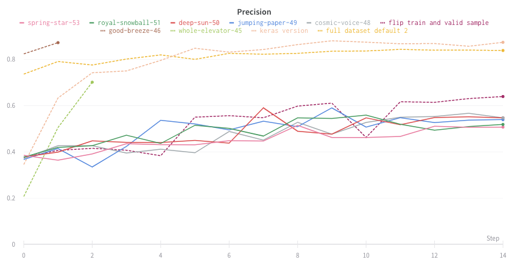

# Line Plot

## Visualize average values on a plot

If you have several different experiments and you'd like to see the average of their values on a plot, you can use the Grouping feature in the table. Click "Group" above the run table and select "All" to show averaged values in your graphs.

Here is what the graph looks like before averaging:

Here I have grouped the lines to see the average value across runs.

## Compare two metrics on one chart

Click on a run to go to the run page. Here's an [example run](https://app.wandb.ai/stacey/estuary/runs/9qha4fuu?workspace=user-carey) from Stacey's Estuary project. The auto-generated charts show single metrics.

Click **Add a visualization** at the top right of the page, and select the **Line Plot**.

In the **Y variables** field, select a few metrics you'd like to compare. They'll show up together on the line graph.

## Visualize on different x axes

If you'd like to see the absolute time that an experiment has taken, or see what day an experiment ran, you can switch the x axis. Here's an example of switching from steps to relative time and then to wall time.

